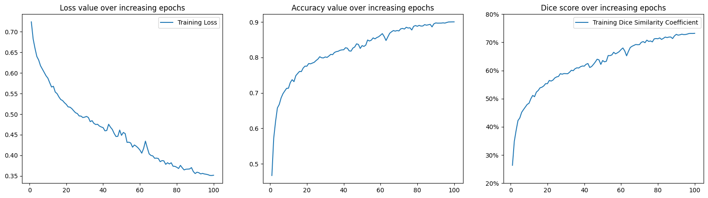
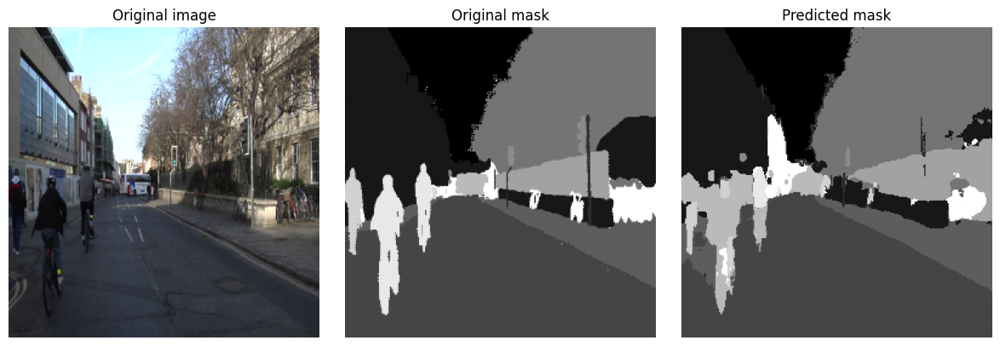

# ***Attention U-Net***

Implementation of Attention U-Net for semantic segmentation.

## **Overview**

- Based on *Attention U-Net: Learning Where to Look for the Pancreas* (Oktay et al., 2018).
- Adds **Attention Gates** to U-Net skip connections to focus on relevant regions.
- The implementation of Att U-Net is more suitable for binary semantic segmentation, for multi-class, the model struggles with finer detials. In fact, U-Net is often just used in binary segmentation, esp for medical image processing. 
- This dataset has large input size of 256x256, the original size is even bigger, hence it requires a bigger model to handle. Training is thus, very expensive for this U-Net.
- Hence, this code is mainly for the purpose of **learning and trying to see if it works**.

## **Model details**

**Features**

* **Encoder–decoder** with **skip connections**
* **Attention Gates** on skips
* **Combo loss** of Focal loss/ Tversky loss/ Dice loss

**Dataset**
* Tested on **Cityscapes-like** datasets, dataset1 from 'Modern Computer Vision using Pytorch' book. [Link to the dataset](https://www.dropbox.com/s/0pigmmmynbf9xwq/dataset1.zip), but chances are the author has removed it.\

**Augmentation**
- Resizing to (256,256)
- Random horizontal flip
- Random vertical flip
- Random crop with padding
- Normalization with mean = [0.485, 0.456, 0.406], std = [0.229, 0.224, 0.225]

## **Training**

**Setup**
- Python: **3.11**
- PyTorch: **2.5.1+cu121**
- GPU: **RTX 4070 Super**

**Hyperparameters**
- Epochs: **100**
- Learning rate: **0.001**
- Optimizer: **Adam** 
- Scheduler: **LinearLR** and **ExponetialLR**

**Training result**
* Dice = 73.2 % 
* Pixel accuracy = 90.0%

**Visualization**
*Metrics plotting*

    
  <em> Training loss and dice </em>

*Segmented output*

    
  <em> Segmented output </em>

## **References**

- Attention U-Net paper: https://arxiv.org/abs/1804.03999
- Modern Computer Vision using PyTorch: https://github.com/PacktPublishing/Modern-Computer-Vision-with-PyTorch-2E
- Focal loss: https://arxiv.org/abs/1708.02002
- Tversky loss: https://arxiv.org/abs/1706.05721
